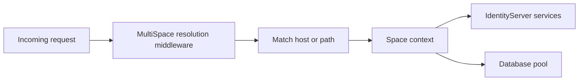

# Multi-Space

> This document describes pre-release multi-space functionality. APIs and behavior may change before general availability.

## Overview

Duende MultiSpace lets a single Duende IdentityServer host serve multiple isolated spaces. Each space represents a separately addressable IdentityServer instance within the same deployment.

A space can have its own issuer, clients, resources, users, sessions, and operational data. For each request, MultiSpace resolves the current space and makes that space available to IdentityServer and application code through a request-scoped context.

This allows one IdentityServer deployment to serve multiple tenants, organizations, environments, or customer partitions without deploying a separate IdentityServer host for each one.

In this pre-release, MultiSpace focuses on the core building blocks required to host multiple IdentityServer spaces:

- defining spaces
- resolving the current space from an incoming request
- exposing the resolved space to IdentityServer and application code
- routing storage and configuration through the resolved space

## When to Use Multi-Space

Use MultiSpace when multiple tenants or organizations can safely share the same IdentityServer deployment, but need separate IdentityServer configuration and runtime state.

Common scenarios include:

- hosting IdentityServer for multiple customer tenants from one deployment
- giving each organization its own issuer, clients, resources, and users
- separating environments, business units, regions, or brands without operating separate IdentityServer deployments
- supporting customers that require logical isolation but do not require a dedicated deployment
- reducing operational overhead when many IdentityServer instances would otherwise have the same hosting, deployment, and upgrade lifecycle

MultiSpace requires the Duende.Storage based architecture. It cannot be used with the Entity Framework based configuration or operational stores. If your IdentityServer host uses Entity Framework stores directly, migrate to the Duende.Storage based architecture before enabling MultiSpace.

MultiSpace can also be introduced gradually. A deployment can start with a single space and add more spaces later, without changing the overall hosting model.

MultiSpace uses database pools as the storage isolation model. Each space is assigned to a pool, and storage operations are routed through the resolved space to the database pool for that space.

MultiSpace is not required when all clients, resources, users, and operational data belong to the same authority. A normal single-space IdentityServer deployment is simpler and remains the right choice for those applications.

Use separate IdentityServer deployments when tenants or organizations require separate hosting, separate upgrade schedules, separate operational ownership, or hard infrastructure isolation.

## Core Concepts

### Space

A space is an isolated IdentityServer authority within a MultiSpace deployment. Each space has a stable space identifier and can have its own issuer, configuration, clients, resources, users, sessions, and operational data.

### Space Context

The space context is the request-scoped state that contains the currently resolved space.

After the MultiSpace resolution middleware identifies a space, application code and IdentityServer services can access the current space through `ISpaceContextAccessor`.

### Space Resolution

Space resolution is the process of identifying which space an incoming request maps to.

Requests go through the MultiSpace resolution middleware. The middleware attempts to identify the space for the request by comparing request information, such as the host or path, against the configured match patterns for known spaces.

If the middleware identifies a matching space, it stores that space in the request's space context. If no matching space is found, the request continues without a current space.

### Space Store

The space store contains the known spaces and their configuration. MultiSpace uses the space store during request resolution and when managing spaces.

### Pool

A pool represents a database pool used for storage isolation. Each space is assigned to a pool. When IdentityServer reads or writes space-aware data, storage is routed to the pool for the current space.

### Match Pattern

A match pattern describes how incoming requests are associated with a space. A space can have one or more match patterns, such as host-based or path-based patterns.

## Request Flow

MultiSpace resolves the current space early in the ASP.NET Core request pipeline. IdentityServer endpoints and application code later in the pipeline can then use the resolved space.



The request flow is:

1. A request enters the ASP.NET Core pipeline.
2. The MultiSpace resolution middleware compares the request to the configured match patterns.
3. If a match is found, the middleware loads the matching space.
4. The middleware stores the space in the request's space context.
5. IdentityServer services use the current space to select the correct configuration, issuer, runtime state, and database pool.
6. Application code can read the current space from `ISpaceContextAccessor`.

Add the MultiSpace resolution middleware before IdentityServer handles requests. If the application uses endpoint routing, add the MultiSpace resolution middleware before routing so path-based space resolution can rewrite the request path before route matching occurs.

## Configuring Multi-Space

MultiSpace is added to the application's service collection. IdentityServer's configuration and operational data must use the Duende.Storage based stores.

```csharp
using Duende.MultiSpace;

var builder = WebApplication.CreateBuilder(args);

builder.Services.AddMultiSpace();

builder.Services
    .AddIdentityServer()
    .AddConfigurationStorage()
    .AddOperationalStorage();
```

MultiSpace requires the Duende.Storage based architecture. Do not configure the Entity Framework configuration or operational stores when using MultiSpace.

Configure MultiSpace options with the standard options pattern:

```csharp
using Duende.MultiSpace;

var builder = WebApplication.CreateBuilder(args);

builder.Services.Configure<MultiSpaceOptions>(options =>
{
    options.SpacePathPrefix = "/t";
    options.LocalCacheExpiration = TimeSpan.FromSeconds(30);
    options.Expiration = TimeSpan.FromMinutes(30);
    options.FallbackToDefault = false;
});
```

`SpacePathPrefix` controls the path prefix used for path-based space resolution. The default value is `/t`.

`LocalCacheExpiration` controls the local in-process cache duration for resolved space data.

`Expiration` controls the distributed cache duration for resolved space data.

`FallbackToDefault` controls what happens when a request cannot be resolved to a space. When `false`, unresolved requests do not get a current space and return a 404. When `true`, unresolved requests use the default space.

Add the MultiSpace resolution middleware before IdentityServer:

```csharp
using Duende.MultiSpace;

var app = builder.Build();

app.UseMultiSpaceResolution();

app.UseIdentityServer();

app.Run();
```

## Resolving the Current Space

MultiSpace resolves spaces by comparing each request with the match patterns configured for known spaces.

The current public match pattern model supports origin matching, path matching, or both:

```csharp
using Duende.MultiSpace;

var hostPattern = new SpaceMatchPattern
{
    Origin = "https://tenant-a.example.com"
};

var pathPattern = new SpaceMatchPattern
{
    Path = "/tenant-a"
};

var hostAndPathPattern = new SpaceMatchPattern
{
    Origin = "https://identity.example.com",
    Path = "/tenant-a"
};
```

### Path-based resolution

Path-based resolution uses `SpacePathPrefix` and the configured path match pattern. The default prefix is `/t`.

For example, a space with this match pattern:

```csharp
using Duende.MultiSpace;

var pattern = new SpaceMatchPattern
{
    Path = "/acme"
};
```

matches requests under `/t/acme`, such as:

```text
https://identity.example.com/t/acme/.well-known/openid-configuration
https://identity.example.com/t/acme/connect/authorize
https://identity.example.com/t/acme/connect/token
```

When the middleware resolves a path-based space, it rewrites the request so downstream routing sees the IdentityServer path without the space prefix. For example, `/t/acme/connect/authorize` is rewritten so downstream middleware sees `/connect/authorize`.

### Host-based resolution

Host-based resolution uses the request origin. The origin includes the scheme, host, and optional port.

```csharp
using Duende.MultiSpace;

var pattern = new SpaceMatchPattern
{
    Origin = "https://acme.example.com"
};
```

This pattern matches requests to `https://acme.example.com`.

### Origin and path resolution

A match pattern can include both `Origin` and `Path`. Use this when the same path should only resolve for a specific origin.

```csharp
using Duende.MultiSpace;

var pattern = new SpaceMatchPattern
{
    Origin = "https://identity.example.com",
    Path = "/acme"
};
```

This pattern matches requests under `/t/acme` only when the request origin is `https://identity.example.com`.

### Fallback to the default space

By default, requests that do not match a configured space are not assigned a current space and will return a 404.

You can change this behavior with `MultiSpaceOptions.FallbackToDefault`. When `FallbackToDefault` is `true`, unresolved requests are assigned `SpaceId.Default`.

```csharp
using Duende.MultiSpace;

builder.Services.Configure<MultiSpaceOptions>(options =>
{
    options.FallbackToDefault = true;
});
```

Use fallback when you are adding MultiSpace to an existing single-space IdentityServer deployment and want unmatched requests to continue using the default space. Disable fallback when every IdentityServer request must match an explicit space.

## Creating and Managing Spaces

Use `ISpaceAdmin` to create, read, update, query, and delete spaces.

The following example creates a space that resolves from the `/t/acme` path:

```csharp
using Duende.MultiSpace;

using var scope = app.Services.CreateScope();

var spaces = scope.ServiceProvider.GetRequiredService<ISpaceAdmin>();

var result = await spaces.CreateAsync(
    new CreateSpaceConfiguration
    {
        Name = "Acme",
        MatchPatterns =
        [
            new SpaceMatchPattern
            {
                Path = "/acme"
            }
        ]
    },
    cancellationToken);

if (!result.IsSuccess)
{
    throw new InvalidOperationException(
        string.Join(Environment.NewLine, result.Errors!.Select(error => error.Message)));
}
```

The following example creates a space that resolves from a dedicated origin:

```csharp
using Duende.MultiSpace;

using var scope = app.Services.CreateScope();

var spaces = scope.ServiceProvider.GetRequiredService<ISpaceAdmin>();

var result = await spaces.CreateAsync(
    new CreateSpaceConfiguration
    {
        Name = "Acme",
        MatchPatterns =
        [
            new SpaceMatchPattern
            {
                Origin = "https://acme.example.com"
            }
        ]
    },
    cancellationToken);

if (!result.IsSuccess)
{
    throw new InvalidOperationException(
        string.Join(Environment.NewLine, result.Errors!.Select(error => error.Message)));
}
```

When `PoolId` is omitted, MultiSpace assigns a pool automatically.

```csharp
using Duende.MultiSpace;

var result = await spaces.CreateAsync(
    new CreateSpaceConfiguration
    {
        Name = "Acme",
        MatchPatterns = [new SpaceMatchPattern { Path = "/acme" }]
    },
    cancellationToken);
```

You can also assign a specific pool ID:

```csharp
using Duende.MultiSpace;

var result = await spaces.CreateAsync(
    new CreateSpaceConfiguration
    {
        Name = "Acme",
        PoolId = (PoolId)1,
        MatchPatterns = [new SpaceMatchPattern { Path = "/acme" }]
    },
    cancellationToken);
```

## Using the Current Space in Application Code

Application code can read the current space from `ISpaceContextAccessor`.

Use `IsSpaceIdConfigured()` before calling `GetSpaceId()` if the code can run without a resolved space:

```csharp
using Duende.MultiSpace;

app.MapGet("/space", (ISpaceContextAccessor spaceContext) =>
{
    if (!spaceContext.IsSpaceIdConfigured())
    {
        return Results.NotFound();
    }

    var spaceId = spaceContext.GetSpaceId();

    return Results.Ok(new
    {
        SpaceId = spaceId.Value
    });
});
```

If the code should fall back to the default space when no space has been resolved, use `GetSpaceIdOrDefault()`:

```csharp
using Duende.MultiSpace;

app.MapGet("/space-or-default", (ISpaceContextAccessor spaceContext) =>
{
    var spaceId = spaceContext.GetSpaceIdOrDefault();

    return Results.Ok(new
    {
        SpaceId = spaceId.Value
    });
});
```

## Limitations in This Pre-Release

This pre-release is intended to validate the core MultiSpace model for IdentityServer. The following limitations apply:

- MultiSpace requires Duende.Storage based configuration and operational stores.
- Entity Framework based IdentityServer stores are not supported.
- Database pools are the supported storage isolation model.
- Space resolution is based on configured origin and path match patterns.
- Custom resolution strategies are not documented here.
- The registration order between MultiSpace and storage is being verified separately. Until that is resolved, this document does not make an order-specific guarantee beyond the examples shown here.

## Next Steps

After configuring MultiSpace:

1. Configure Duende.Storage for the database provider used by the host.
2. Add `UseMultiSpaceResolution()` before IdentityServer in the ASP.NET Core pipeline.
3. Create the initial space.
4. Add match patterns for the hosts or paths that should resolve to that space.
5. Verify the discovery document, authorize endpoint, token endpoint, and operational flows for each space.
6. Add additional spaces when you need another isolated IdentityServer authority in the same deployment.